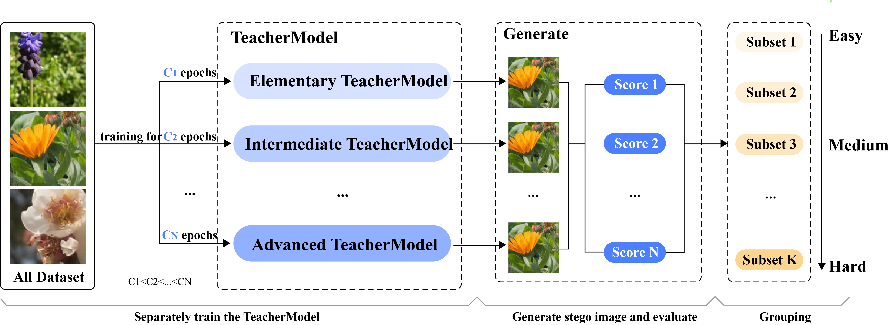
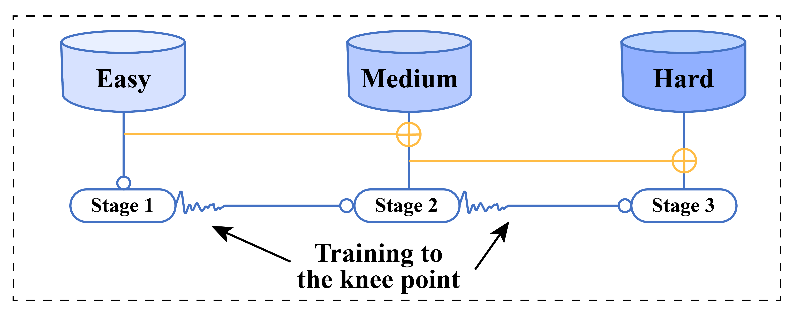
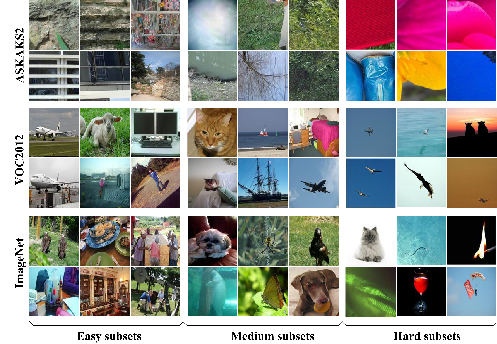
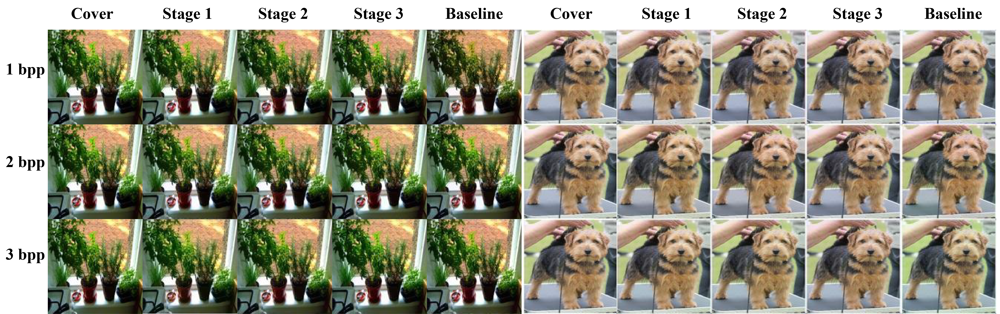

# STCL
## STCL:Curriculum learning Strategies for deep learning image steganography models

#### Fengchun Liu; Tong Zhang; Chunying Zhang

This repository contains the official implementation of the paper "STCL:Curriculum learning Strategies for deep learning image steganography models".


## Introduction

Aiming at the problems of poor quality of steganographic images and slow network convergence of image steganography models based on deep learning, this paper proposes a Steganography Curriculum Learning training strategy (STCL)  for deep learning image steganography models. So that only easy images are selected for training when the model has poor fitting ability at the initial stage, and gradually expand to more difficult images, the strategy includes a difficulty evaluation strategy based on the teacher model and an knee point-based training scheduling strategy. Firstly, multiple teacher models are trained, and the consistency of the quality of steganographic images under multiple teacher models is used as the difficulty score to construct the training subsets from easy to difficult. Secondly, a training control strategy based on knee points is proposed to reduce the possibility of overfitting on small training sets and accelerate the training process. Experimental results on three large public datasets, ALASKA2, VOC2012 and ImageNet, show that the proposed image steganography scheme is able to improve the model performance under multiple algorithmic frameworks, which not only has a high PSNR, SSIM score, and decoding accuracy, but also the steganographic images generated by the model under the training of the STCL strategy have a low steganography analysis scores.

## Project Structure
 ```
├── evaluation/                # Evaluation related files
│   ├── evaluation.py          # Sample difficulty assessment script
│   ├── TeacherModel.py        # Teacher model architecture implementation
│   ├── MS_SSIM.py             # Metrics calculation (SSIM, MS-SSIM, PSNR)
│   └── test/                  # Directory for evaluation results
│       ├── easy/              # Easy samples
│       ├── medium/            # Medium difficulty samples
│       ├── hard/              # Hard samples
│       └── em/                # Additional samples for analysis
├── image/                     # Figures for README
│   ├── fig1.png               # Difficulty Evaluation Strategies
│   ├── fig2.png               # Training subsets with different difficulties
│   ├── fig3.png               # Multi-stage scheduling rules
│   ├── fig4.jpg               # Comparison of cover and stego images
│   ├── fig5.png               # Comparison of multi-stage model
│   └── fig6.jpg               # Comparative validation
├── pt/                        # Pre-trained models
│   ├── dstnet_noCL.pth    # Model trained without curriculum learning
│   ├── dstnet_stage1.pth  # STCL Stage 1 model weights
│   ├── dstnet_stage2.pth  # STCL Stage 2 model weights
│   └── dstnet_stage3.pth  # STCL Stage 3 model weights
├── sample/                  # Test result images
│   ├── 13_carrier.jpg     # Cover image sample
│   ├── 13_noCL_d1.jpg     # Stego image generated by model without CL
│   ├── 13_noCL_d2.jpg     # Stego image generated by model without CL
│   ├── 13_noCL_d3.jpg     # Stego image generated by model without CL
│   ├── 13_stage1_d1.jpg   # Stego image generated by Stage 1 model
│   ├── 13_stage1_d2.jpg   # Stego image generated by Stage 1 model
│   ├── 13_stage1_d3.jpg   # Stego image generated by Stage 1 model
│   ├── 13_stage2_d1.jpg   # Stego image generated by Stage 2 model
│   ├── 13_stage2_d2.jpg   # Stego image generated by Stage 2 model
│   ├── 13_stage2_d3.jpg   # Stego image generated by Stage 2 model
│   ├── 13_stage3_d1.jpg   # Stego image generated by Stage 3 model
│   ├── 13_stage3_d2.jpg   # Stego image generated by Stage 3 model
│   ├── 13_stage3_d3.jpg   # Stego image generated by Stage 3 model
│   └── other test images...  # More test images                  
 ```

## Model Weights

Models trained using the STCL strategy are available in the `./` directory:
- dstnet_stage1.pth (Stage 1 of STCL training)
- dstnet_stage2.pth (Stage 2 of STCL training)
- dstnet_stage3.pth (Stage 3 of STCL training)
- dstnet_noCL.pth (Model trained without curriculum learning for comparison)

## Evaluation

To evaluate sample difficulty, run:
```bash
python evaluation.py --ssim_high 0.90 --ssim_low 0.85 --msssim_high 0.90 --msssim_low 0.85 --psnr_threshold 25
```
Parameters:
- ssim_high : High threshold for SSIM (default: 0.90)
- ssim_low : Low threshold for SSIM (default: 0.85)
- msssim_high : High threshold for MS-SSIM (default: 0.90)
- msssim_low : Low threshold for MS-SSIM (default: 0.85)
- psnr_threshold : Threshold for PSNR (default: 25)

The evaluation results will be saved in:
- test_cl.xlsx : Detailed metrics for each sample
- easy/ : Easy samples
- medium/ : Medium difficulty samples
- hard/ : Hard samples



## Results
Detailed experimental results are presented in the paper.





## Citation
If you find our work useful in your research, please consider citing:	arXiv:2504.17609


## Contact
If you encounter any issues while using this repository, please feel free to leave messages in issues or contact us at:

- zenozt@bupt.edu.cn
We will respond as soon as possible.
